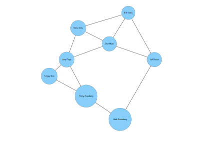



| [Матрица смежности] | Bill | Steve | Elon | Larry | Sergey | Sheryl | Jeff | Mark |
|---------------------|------|-------|------|-------|--------|--------|------|------|
| [0] Bill            | 0    | 1     | 1    | 0     | 0      | 0      | 1    | 0    |
| [1] Steve           | 1    | 0     | 1    | 1     | 0      | 0      | 0    | 0    |
| [2] Elon            | 1    | 1     | 0    | 1     | 0      | 0      | 1    | 0    |
| [3] Larry           | 0    | 1     | 1    | 0     | 1      | 1      | 0    | 0    |
| [4] Sergey          | 0    | 0     | 0    | 1     | 0      | 1      | 0    | 0    |
| [5] Sheryl          | 0    | 0     | 0    | 1     | 1      | 0      | 0    | 1    |
| [6] Jeff            | 1    | 0     | 1    | 0     | 0      | 0      | 0    | 1    |
| [7] Mark            | 0    | 0     | 0    | 0     | 0      | 1      | 1    | 0    |


Способ хранения в зубчатом массиве (jagged array):

```csharp
int[][] adjacencyMatrix = {
   // Bill, Steve, Elon, Larry, Sergey, Sheryl, Jeff, Mark
   new[] { 0, 1, 1, 0, 0, 0, 1, 0 }, // Bill
   new[] { 1, 0, 1, 1, 0, 0, 0, 0 }, // Steve
   new[] { 1, 1, 0, 1, 0, 0, 1, 0 }, // Elon
   new[] { 0, 1, 1, 0, 1, 1, 0, 0 }, // Larry
   new[] { 0, 0, 0, 1, 0, 1, 0, 0 }, // Sergey
   new[] { 0, 0, 0, 1, 1, 0, 0, 1 }, // Sheryl
   new[] { 1, 0, 1, 0, 0, 0, 0, 1 }, // Jeff
   new[] { 0, 0, 0, 0, 0, 1, 1, 0 }  // Mark
};
```

В этом случае для хранение названий вершин нам понадобится отдельный массив:

```csharp
string[] personNames = {
    "Bill",   //0
    "Steve",  //1
    "Elon",   //2
    "Larry",  //3
    "Sergey", //4
    "Sheryl", //5
    "Jeff",   //6
    "Mark"    //7
};
```
