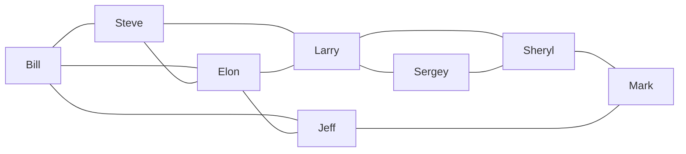
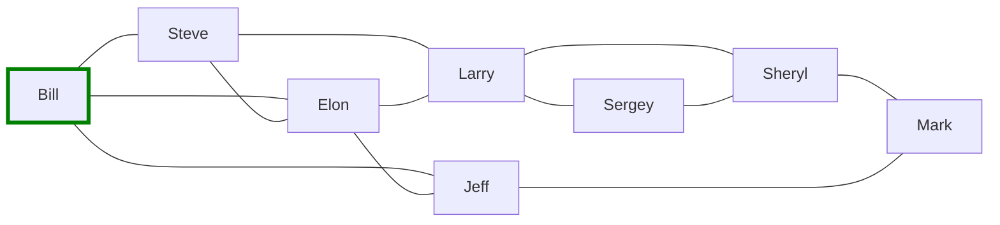

# BFS On Friends Graph

```mermaid
graph LR
    A[Bill] --- B[Steve]
    A --- C[Elon]
    A --- G[Jeff]
    B --- C
    B --- D[Larry]
    C --- D
    C --- G
    D --- E[Sergey]
    D --- F[Sheryl]
    E --- F
    F --- H[Mark]
    G --- H
```

## Step 1

```mermaid
graph LR
    style A stroke:green,stroke-width:4px
    A[Bill] --- B[Steve]
    A --- C[Elon]
    A --- G[Jeff]
    B --- C
    B --- D[Larry]
    C --- D
    C --- G
    D --- E[Sergey]
    D --- F[Sheryl]
    E --- F
    F --- H[Mark]
    G --- H
```