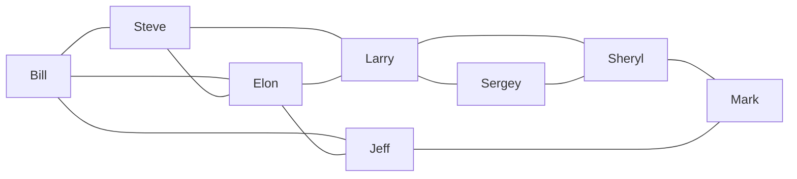
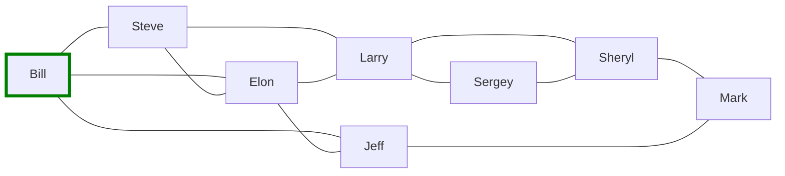
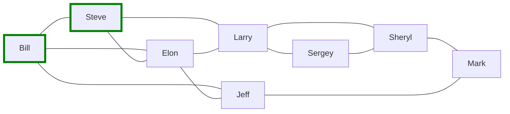
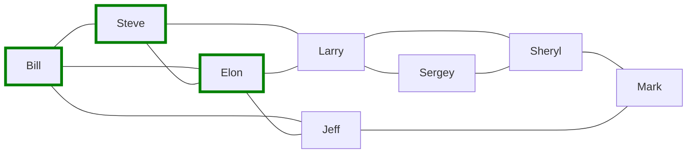
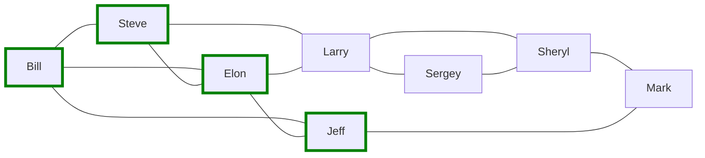
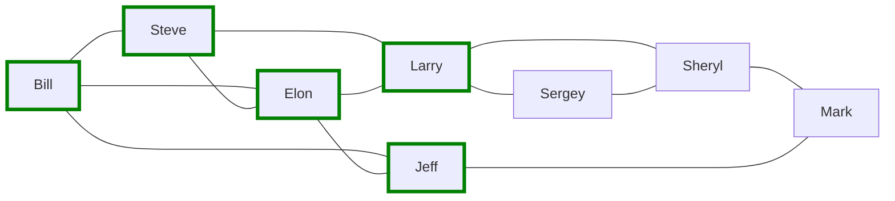
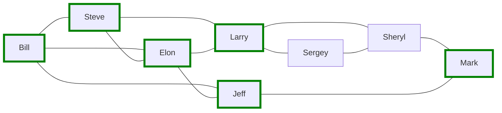
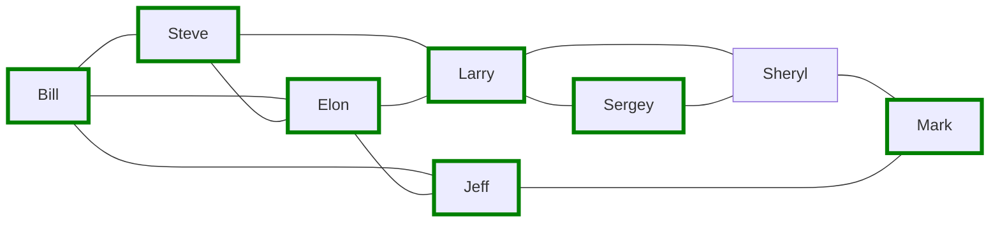
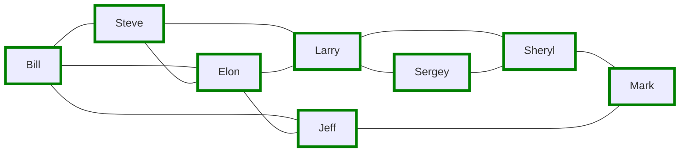

# BFS On Friends Graph

## Дан граф


## Step 1: Bill


## Step 2: Steve


## Step 3: Elon


## Step 4: Jeff


Step 5: Bill (Already Visited)
------------------------------

Queue: Elon, Larry, Bill, Steve, Larry, Jeff, Bill, Elon, Mark

Visited: Bill, Steve, Elon, Jeff

Step 6: Elon (Already Visited)
------------------------------

Queue: Larry, Bill, Steve, Larry, Jeff, Bill, Elon, Mark

Visited: Bill, Steve, Elon, Jeff

Step 7: Larry
-------------

Queue: Bill, Steve, Larry, Jeff, Bill, Elon, Mark, Steve, Elon, Sergey, Sheryl

Visited: Bill, Steve, Elon, Jeff

mermaid



Step 8: Bill (Already Visited)
------------------------------

Queue: Steve, Larry, Jeff, Bill, Elon, Mark, Steve, Elon, Sergey, Sheryl

Visited: Bill, Steve, Elon, Jeff, Larry

Step 9: Steve (Already Visited)
-------------------------------

Queue: Larry, Jeff, Bill, Elon, Mark, Steve, Elon, Sergey, Sheryl

Visited: Bill, Steve, Elon, Jeff, Larry

Step 10: Larry (Already Visited)
--------------------------------

Queue: Jeff, Bill, Elon, Mark, Steve, Elon, Sergey, Sheryl

Visited: Bill, Steve, Elon, Jeff, Larry

Step 11: Jeff (Already Visited)
-------------------------------

Queue: Bill, Elon, Mark, Steve, Elon, Sergey, Sheryl

Visited: Bill, Steve, Elon, Jeff, Larry

Step 12: Bill (Already Visited)
-------------------------------

Queue: Elon, Mark, Steve, Elon, Sergey, Sheryl

Visited: Bill, Steve, Elon, Jeff, Larry

Step 13: Elon (Already Visited)
-------------------------------

Queue: Mark, Steve, Elon, Sergey, Sheryl

Visited: Bill, Steve, Elon, Jeff, Larry

Step 14: Mark
-------------

Queue: Steve, Elon, Sergey, Sheryl, Sheryl, Jeff

Visited: Bill, Steve, Elon, Jeff, Larry

mermaid



Step 15: Steve (Already Visited)
--------------------------------

Queue: Elon, Sergey, Sheryl, Sheryl, Jeff

Visited: Bill, Steve, Elon, Jeff, Larry, Mark

Step 16: Elon (Already Visited)
-------------------------------

Queue: Sergey, Sheryl, Sheryl, Jeff

Visited: Bill, Steve, Elon, Jeff, Larry, Mark

Step 17: Sergey
---------------

Queue: Sheryl, Sheryl, Jeff, Larry, Sheryl

Visited: Bill, Steve, Elon, Jeff, Larry, Mark

mermaid



Step 18: Sheryl
---------------

Queue: Sheryl, Jeff, Larry, Sheryl

Visited: Bill, Steve, Elon, Jeff, Larry, Mark, Sergey

mermaid



Step 19: Sheryl (Already Visited)
---------------------------------

Queue: Jeff, Larry, Sheryl, Larry, Sergey, Mark

Visited: Bill, Steve, Elon, Jeff, Larry, Mark, Sergey, Sheryl

Step 20: Jeff (Already Visited)
-------------------------------

Queue: Larry, Sheryl, Larry, Sergey, Mark

Visited: Bill, Steve, Elon, Jeff, Larry, Mark, Sergey, Sheryl

Step 21: Larry (Already Visited)
--------------------------------

Queue: Sheryl, Larry, Sergey, Mark

Visited: Bill, Steve, Elon, Jeff, Larry, Mark, Sergey, Sheryl

Step 22: Sheryl (Already Visited)
---------------------------------

Queue: Larry, Sergey, Mark

Visited: Bill, Steve, Elon, Jeff, Larry, Mark, Sergey, Sheryl

Step 23: Larry (Already Visited)
--------------------------------

Queue: Sergey, Mark

Visited: Bill, Steve, Elon, Jeff, Larry, Mark, Sergey, Sheryl

Step 24: Sergey (Already Visited)
---------------------------------

Queue: Mark

Visited: Bill, Steve, Elon, Jeff, Larry, Mark, Sergey, Sheryl

Step 25: Mark (Already Visited)
-------------------------------

Queue:

Visited: Bill, Steve, Elon, Jeff, Larry, Mark, Sergey, Sheryl

## Реализация:
```csharp
void BFS(Dictionary<string, List<string>> adjacencyList)
{
    var visited = new HashSet<string>();
    var queue = new Queue<string>();
    queue.Enqueue("Bill");
    while (queue.Count > 0)
    {
        var current = queue.Dequeue();
        if (visited.Contains(current)) continue;
        visited.Add(current);
        Console.WriteLine(current);
        foreach (var neighbor in adjacencyList[current])
        {
            queue.Enqueue(neighbor);
        }
    }
}
```
https://github.com/rodion-m/AlgorithmsCourse2023/blob/master/GraphLesson/Representations/GraphAdjacencyListOnDictionary.BFS.cs